# Procesverslag
Markdown is een simpele manier om HTML te schrijven.  
Markdown cheat cheet: [Hulp bij het schrijven van Markdown](https://github.com/adam-p/markdown-here/wiki/Markdown-Cheatsheet).

Nb. De standaardstructuur en de spartaanse opmaak van de README.md zijn helemaal prima. Het gaat om de inhoud van je procesverslag. Besteedt de tijd voor pracht en praal aan je website.

Nb. Door *open* toe te voegen aan een *details* element kun je deze standaard open zetten. Fijn om dat steeds voor de relevante stuk(ken) te doen.

## Jij

  
uitwerken voor kick-off werkgroep

  ### Auteur:
  Pepijn Lenten

  #### Je startniveau:
  blauw

  #### Je focus:
 Responsive
 

## Je website

  
uitwerken voor kick-off werkgroep

  ### Je opdracht:
https://www.guusmeeuwis.nl

  #### Screenshot(s) van de eerste pagina (small screen): 
  https://www.guusmeeuwis.nl/nieuws
 

  #### Screenshot(s) van de tweede pagina (small screen):
https://www.guusmeeuwis.nl/muziek 
    
 

## Toegankelijkheidstest 1/2 (week 1)

  
uitwerken na test in 2e werkgroep

  ### Bevindingen
  Lijst met je bevindingen die in de test naar voren kwamen:
Test ballon
-Lastig focussen op 1 ding
-1 primaire actie per scherm zou helpen
-Teveel tekst is onmogelijk te lezen
-Grote knoppen
<ul>
  <li>Lastig focussen op 1 ding</li>
<li>1 primaire actie per scherm zou helpen</li>
<li>Teveel tekst is onmogelijk te lezen</li>
<li>Grote knoppen</li>
  </ul>
Test bril
-Grote knoppen en iconen
-Zoekbalk helpt goed, het is lastig om te zoeken met scrollen door producten
-Muis icoontje op het scherm was snel kwijt
-Veel kleine tekst is niet leesbaar
-Veel contrast
<ul>
<li>Grote knoppen en iconen</li>
<li>Zoekbalk helpt goed, het is lastig om te zoeken met scrollen door producten</li>
<li>Muis icoontje op het scherm was snel kwijt</li>
<li>Veel kleine tekst is niet leesbaar</li>
<li>Veel contrast</li>
  </ul>

  WCAG checklist
  <ul>
  <li>met screenreader hoor je de titels van de linkjes 2 keer dubbel, niet zo fijn. </li>
    <li>h2 is een link en een kop in een wat erg verwarrend is. Hij heeft geen hover maar je kan er wel op klikken.</li>
    <li>alle images hebben een alt atribuut</li>
    <li>De website heeft geen focus states, het is gewoon de standaard vormgeving.</li>
    <li>Er is geen dark mode voor de website.</li>
    </ul>
    <li>Er is een goed kleurcontrast</li>

## Breakdownschets (week 1)

  
uitwerken na afloop 3e werkgroep

  ### de hele pagina: 
  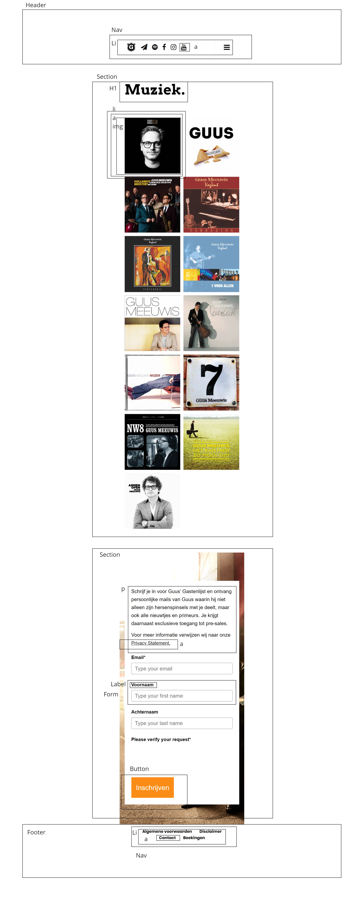

  ### dynamisch deel (bijv menu): 
  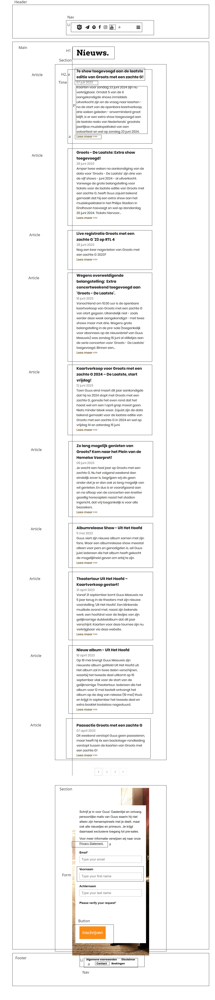

## Voortgang 1 (week 2)

  
uitwerken voor 1e voortgang

  ### Stand van zaken
  hier dit ging goed & dit was lastig (neem ook screenshots op van delen van je website en code)
Wat goed gaat is de html en de basis-css van mijn website. Het begint al te lijken op de website die ik heb gekozen, alleen de details die het echt professioneel maken missen nog. Waar ik moeite mee heb is de 
form. Ik heb er nog niet heel goed naar gekeken maar ik vind dit onderdeel nog wel lastig. De header is ook nog niet helemaal top maar hier heb ik wel een stuk meer vertrouwen in. Doordat ik ook een hele hoop vergeten ben van vorig jaar vind ik het ook nog lastig om de juiste selectoren te gebruiken. Ik selecteer vaak niet specefiek gennoeg waardoor alles verandert.

 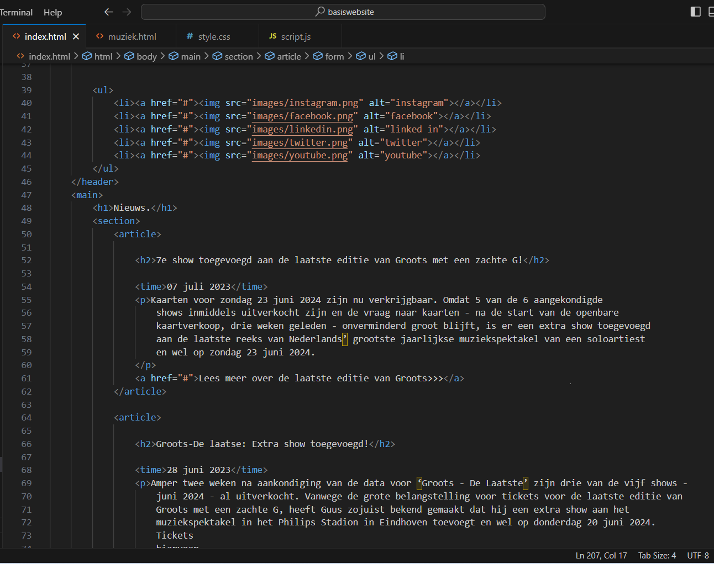
 Hierboven de html die ik tot nu toe geschreven heb.
 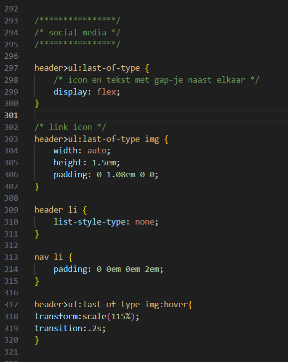
 Hier de header en de selectoren waar ik een beetje mee struggle.

  ### Agenda voor meeting
  samen met je groepje opstellen
Kijken naar lijn die links loopt op de nieuwspagina.
vragen hoe ik de form het best kan doen.
Vragen hoe ik mijn header kan verbeteren.

  ### Verslag van meeting
  hier na afloop snel de uitkomsten van de meeting vastleggen

  - onderzoek doen hoe een form werkt.
  - navigatie afmaken, logo in het midden zien te krijgen.
  - footer met navigatie erin maken.

## Voortgang 2 (week 3)

  
uitwerken voor 2e voortgang

  ### Stand van zaken
  hier dit ging goed & dit was lastig (neem ook screenshots op van delen van je website en code)
Ik had in week 3 nog steeds moeite met de form. Ik heb een hele tijd gekloot met de afbeelding en daarvoor het witte blokje met de form erin. Ik heb het geprobeert met onder andere position relative en absolute maar dit ging hele gekke dingen doen. Ook heb ik deze week de header en mijn nav helemaal netjes gemaakt. Daarnaast heb ik deze week vooral gefocust op de vormgeving van mijn pagina. Ik heb dus alle articles en koppen netjes gemaakt en alle padding en margin mooi gemaakt. ik ben deze week ook gaan kijken naar animaties maar heb er toen toch voor besloten dat ik voor responsive ga. De animaties gingen me best goed af maar toen ik naar de rest van het lijstje keek leek me responsive toch de betere optie. Ik heb ook alvast een beetje nagedacht over hoe ik mijn website wat leuker kan maken, hij is nu nog namelijk een beetje saai. Het is me deze week ook gelukt om links van mijn artikelen een zwart lijntje te krijgen, dit was een stuk makkelijker dan ik dacht.....
 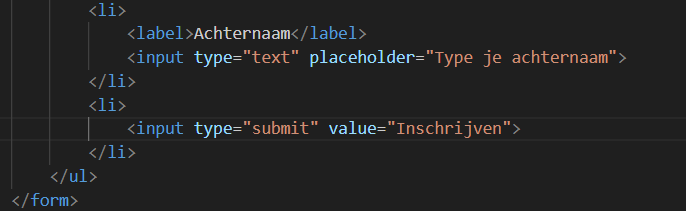
 Dit is wat ik tot nu toe heb voor mn form.
  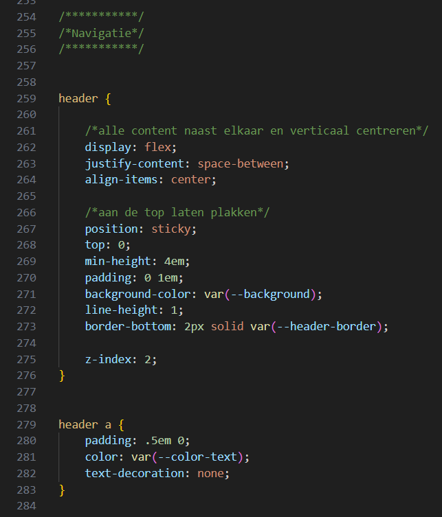
  
   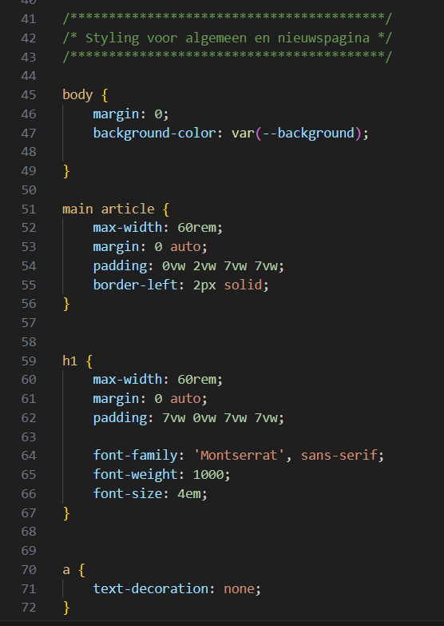
  ### Agenda voor meeting
  samen met je groepje opstellen
  
Ik had nog een vraagje over forms waar ik niet helemaal uitkwam, ik weet niet hoe ik de user experience hiervan optimaal kan maken. Ook vraag ik me af of een  e werkgroep

  ### Bevindingen
  Lijst met je bevindingen die in de test naar voren kwamen (geef ook aan wat er verbeterd is):
<ul>
  <li>Bij ieder linkje stond lees meer, dit is natuurlijk niet handig voor slechtzienden dus dit heb ik aangepast naar een naam die wat meer uitlegd.</li>
  <li>De social media iconen hadden geen alt tekst, dit heb ik aangepast.</li>
  <li>Nog geen dark mode, moet dit nog gaan verwerken in mijn website.</li>
  <li>Focus state verbteren, hij heeft nu een rare padding waardoor het af en toe lastig te lezen is.</li>
  <li>Skip link? Weet niet wat het precies inhoudt maar ik heb het niet.</li>
  <li>Ik heb in de input engelse tekst geschreven die hij in het Nederlands voorleest, dit is onverstaanbaar en moet ik nog aanpassen.</li>
  <li> Ik heb mijn code ook nog door de validator gehaald en daar kwam uit dat ik het time element niet goed heb gebruikt. Er moet hier nog een datetime bij zodat de zoekmachine hiernaar kan zoeken, dit heb ik ook aangepast.
</li>
</ul>

## Voortgang 3 (week 4)

  
uitwerken voor 3e voortgang

  ### Stand van zaken
  hier dit ging goed & dit was lastig (neem ook screenshots op van delen van je website en code)
Ik was deze week erg aan het struggelen met de selectoren. Doordat mijn code steeds langer werdt moest ik ook steeds specefieker zijn in het selecteren van elementen. Veel code die ik al geschreven had paste toe op andere stukken code waardoor het niet deed wat ik wilde, zoals de sections en article op mijn muziekpagina. Ik wou een simpele hover maken op mijn images maar dit bleek toch nog een stuk lastiger te zijn omdat alles elkaar maar bleef selecteren. Verder ben ik eindelijk geslaagd met de form, de achtergrond en voorgrond staan eindelijk waar ik erg blij mee ben. Ook de form zelf doet het waar ik wat mee heb geëxperimenteert. Ik ben deze week ook druk bezig geweest met de states. Ik heb op alles een hover en active state gezet op mijn website zo duidelijk mogelijk te maken. Ik heb ook de focus state een beetje aangepast zodat hij nu wat netter is. Ik ben ook bezig geweest met de paginanummers onder de artikelen maar deze zijn nog niet helemaal af. Ik heb wel nog een probleempje, als ik over mijn afbeelding hover dan gaat hij over de navigatie wat een beetje gek is, dit moet ik nog even navragen.

 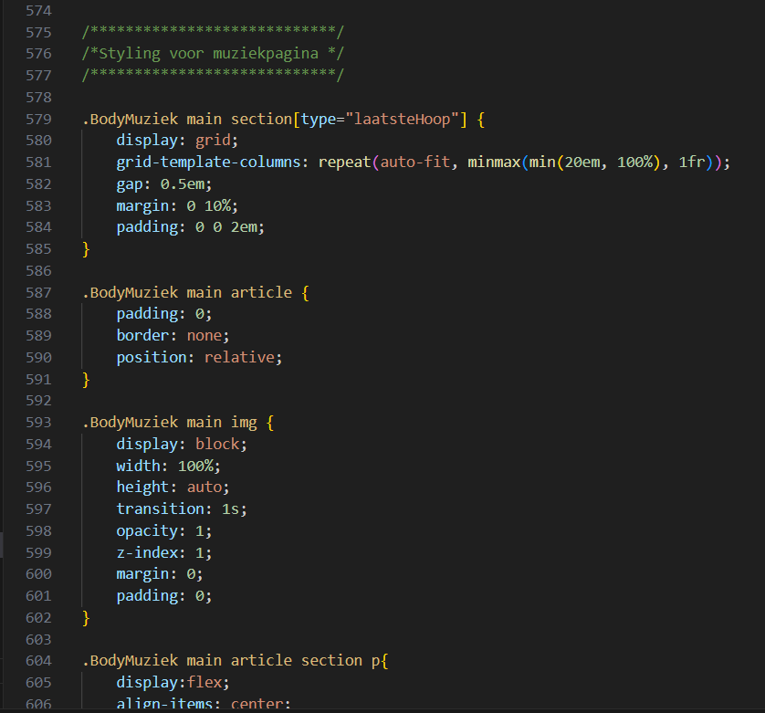
 Dit hierboven is de form waar ik mee zat.
  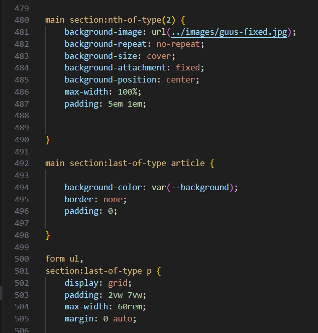
   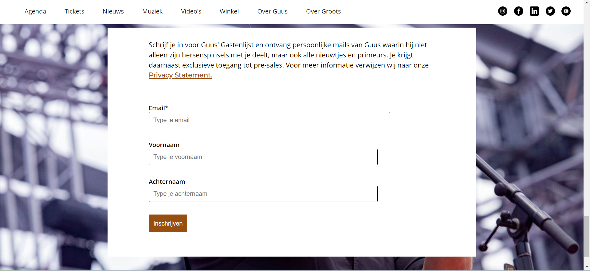
 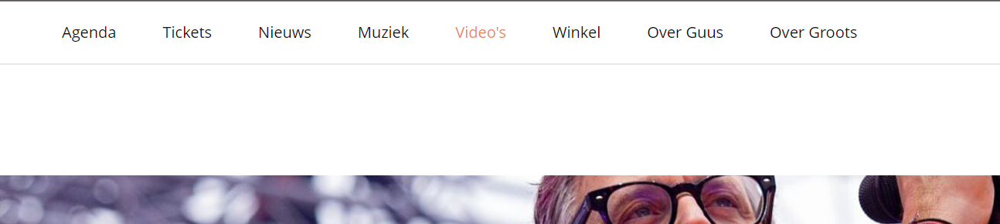
 Hier de hover states in de website.
  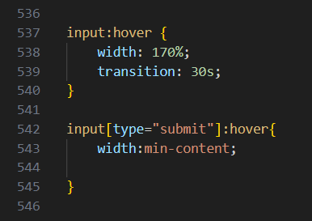
   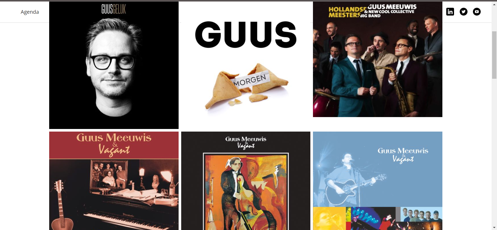
   Het probleem wat ik had met de plaatjes over de nav.
    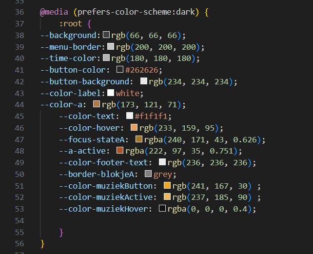
    dark-mode setting
     
      
      De tijd in mijn html na de validator
 
  ### Agenda voor meeting
  Vragen waarom mijn plaatjes over de nav scrollen. 
  Vragen hoe ik het best dingen kan selecteren, mijn nav in de footer styled nu hetzelfde als mijn nav in de header.

  ### Verslag van meeting
  hier na afloop snel de uitkomsten van de meeting vastleggen

  - Afbeelding hover aangepast met z-index
  - Nav in de footer wordt geselecteerd door mijn nav in de header, hiernaar gekeken en aangepast.
  - Paginanummers onder het artikel in een flex-wrap gezet zodat hij niet buiten mijn pagina valt.

## Eindgesprek (week 5)

  
uitwerken voor eindgesprek

  ### Je uitkomst - karakteristiek screenshots:
  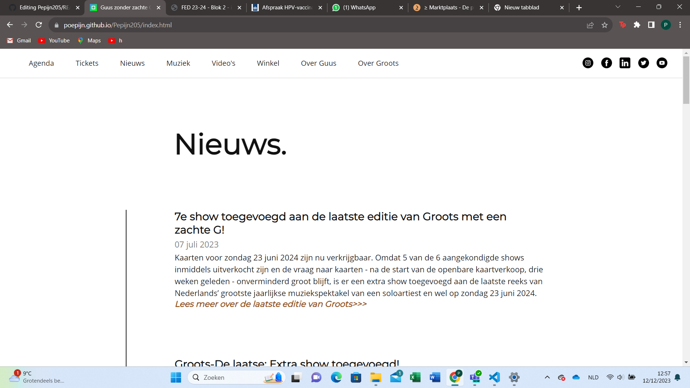
  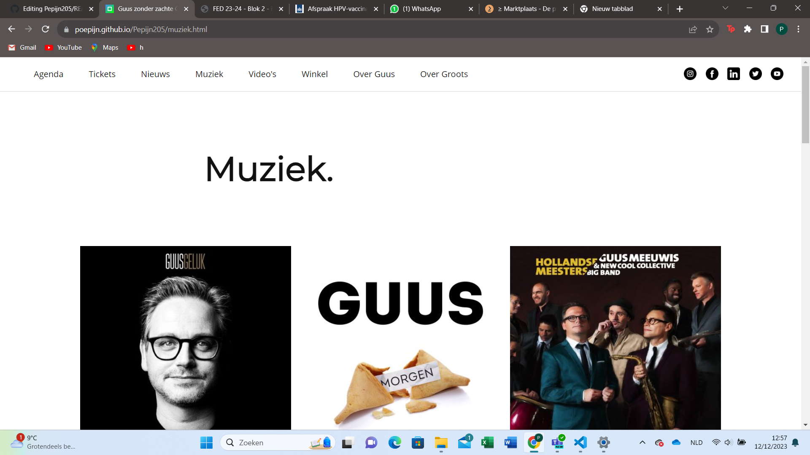

  ### Dit ging goed/Heb ik geleerd: 
  Korte omschrijving met plaatjes
Wat ik geleerd heb is dat je niet alles met classes hoeft te doen maar ook vrij gemakkelijk dingen kan selecteren zonder, ook al heeft dit wel even geduurt voordat ik dit onder de knie hadt. Verder heb ik geleerd hoe je een website responsive maakt en dingen binnen je browser houdt. Ik heb hier voor dit vak onwijs veel moeite mee gehad en mijn website was altijd horizontaal aan het scrollen maar dat is deze keer wel gelukt.
  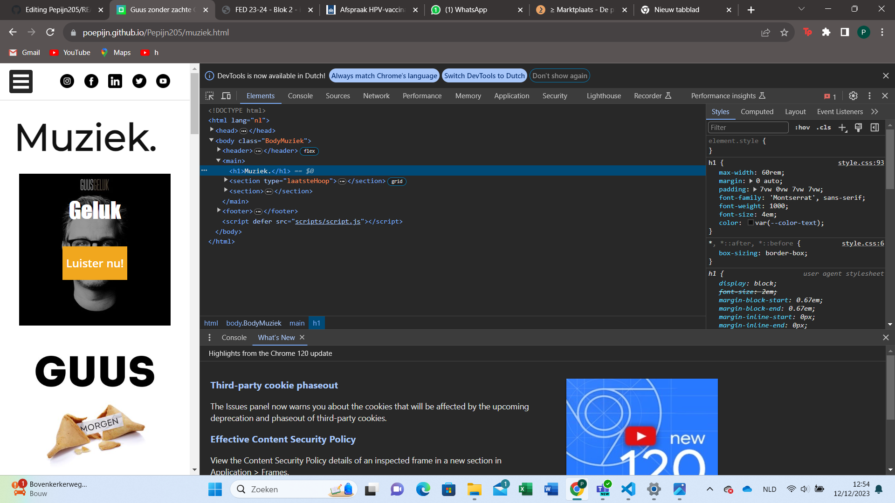

  ### Dit was lastig/Is niet gelukt:
  Korte omschrijving met plaatjes
Waar ik moeite mee had waren de geavanceerde animaties/ states. Al mijn buttons en linkjes hebben relatief simpele states, ik heb hier best veel aandacht aan besteed maar ik begreep het gewoon niet.
  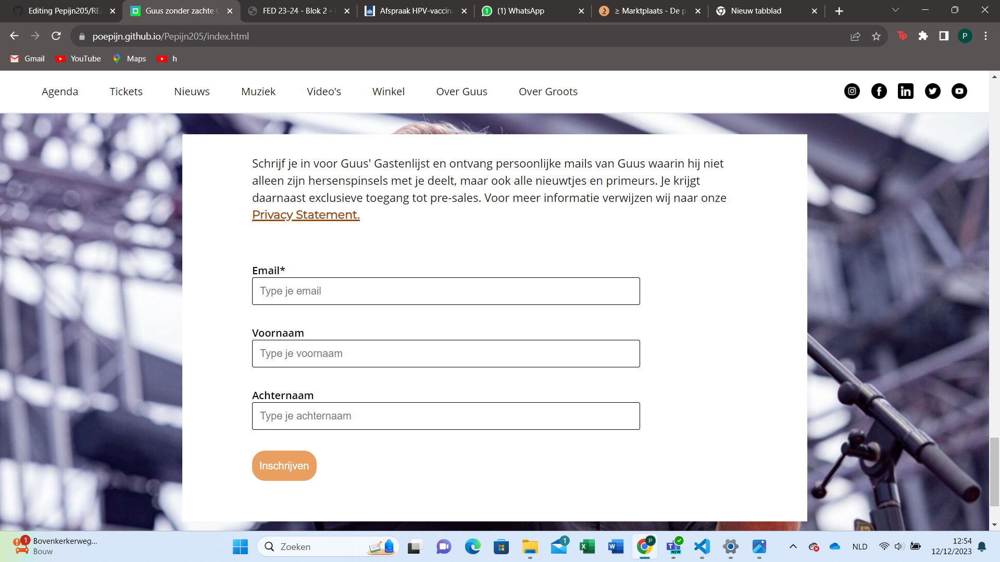

## Bronnenlijst

  
continu bijhouden terwijl je werkt

  Nb. Wees specifiek ('css-tricks' als bron is bijv. niet specifiek genoeg). 
  Nb. ChatGpT en andere AI horen er ook bij.
  Nb. Vermeld de bronnen ook in je code.
<ul>
  <li>1. Learn web(03-08-2023) How To Overlay A Text On An Image | CSS Overlay[Video], 
Youtube. Geraadpleegd op: 09-12-2023, van:https://www.youtube.com/watch?v=Qt-70hrdJZI</li>
 <li>2. riajulislam(Z.D). facebook free icon. Geraadpleegd op: 02-12-2023, van:https://www.flaticon.com/free-icon/facebook_4494464?related_id=4494464&origin=pack</li> 
  <li>3. riajulislam(Z.D). instagram free icon. Geraadpleegd op: 02-12-2023, van:https://www.flaticon.com/free-icon/instagram_4494468?related_id=4494468&origin=pack</li>
 <li>4. riajulislam(Z.D). twitter free icon. Geraadpleegd op: 02-12-2023, van:https://www.flaticon.com/free-icon/twitter_4494465?related_id=4494465&origin=pack</li> 
 <li> 5. riajulislam(Z.D). linkedin free icon. Geraadpleegd op: 02-12-2023, van:https://www.flaticon.com/free-icon/linkedin_4494471?related_id=4494471&origin=pack</li>
 <li>6. riajulislam(Z.D). free Youtube icon. Geraadpleegd op: 02-12-2023, van:https://www.flaticon.com/free-icon/youtube_4494467?related_id=4494467&origin=pack</li> 
 <li>7. Spek, L.(Z.D). Guus Meeuwis, we zijn alleen met vrienden. Geraadpleegd op: 05-12-2023, van:https://www.baarnschecourant.nl/lokaal/overig/946466/guus-meeuwis-we-zijn-alleen-met-vrienden</li> 
 <li>8. Meeuwis, G(Z.D). Guus Geluk. Geraadpleegd op: 27-11-2023, van:https://guusmeeuwis.nl/category/muziek/ </li> 
  <li>9. Meeuwis, G(Z.D). Morgen. Geraadpleegd op: 27-11-2023, van:https://guusmeeuwis.nl/category/muziek/ </li> 
   <li>10. Meeuwis, G(Z.D). Hollandse Meesters. Geraadpleegd op: 27-11-2023, van:https://guusmeeuwis.nl/category/muziek/ </li> 
   <li>11. Meeuwis, G(Z.D). Verbazing. Geraadpleegd op: 27-11-2023, van:https://guusmeeuwis.nl/category/muziek/ </li> 
   <li>12. Meeuwis, G(Z.D). Schilderij. Geraadpleegd op: 27-11-2023, van:https://guusmeeuwis.nl/category/muziek/ </li> 
   <li>13. Meeuwis, G(Z.D). Een voor allen. Geraadpleegd op: 27-11-2023, van:https://guusmeeuwis.nl/category/muziek/ </li> 
   <li>14. Meeuwis, G(Z.D). Guus. Geraadpleegd op: 27-11-2023, van:https://guusmeeuwis.nl/category/muziek/ </li> 
   <li>15. Meeuwis, G(Z.D). 10 jaar levensecht. Geraadpleegd op: 27-11-2023, van:https://guusmeeuwis.nl/category/muziek/ </li> 
   <li>16. Meeuwis, G(Z.D). Wijzer. Geraadpleegd op: 27-11-2023, van:https://guusmeeuwis.nl/category/muziek/ </li> 
   <li>17. Meeuwis, G(Z.D). Hemel nr. 7. Geraadpleegd op: 27-11-2023, van:https://guusmeeuwis.nl/category/muziek/ </li> 
   <li>18. Meeuwis, G(Z.D). NW8. Geraadpleegd op: 27-11-2023, van:https://guusmeeuwis.nl/category/muziek/ </li> 
   <li>19. Meeuwis, G(Z.D). Het kan hier zo mooi zijn. Geraadpleegd op: 27-11-2023, van:https://guusmeeuwis.nl/category/muziek/ </li> 
   <li>20. Meeuwis, G(Z.D). Armen open. Geraadpleegd op: 27-11-2023, van:https://guusmeeuwis.nl/category/muziek/ </li> 
</ul>

